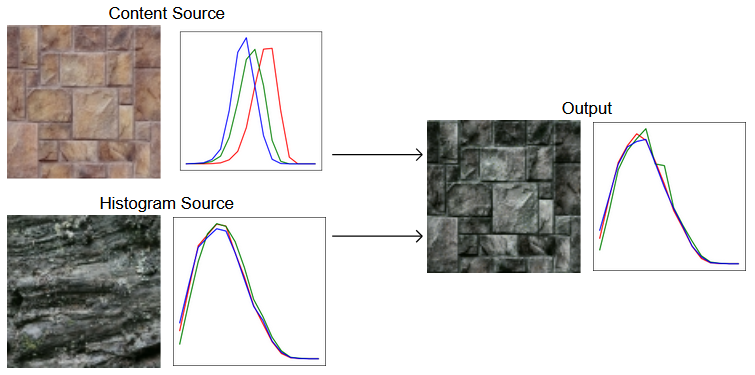
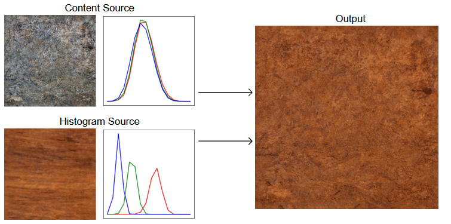
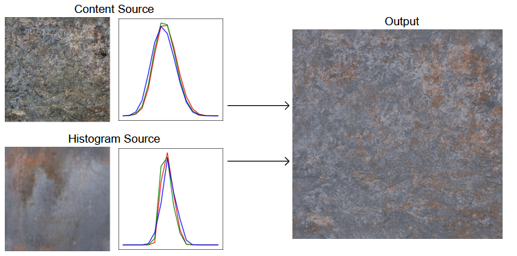
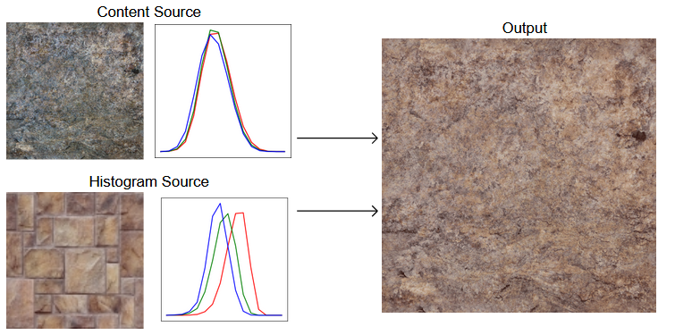
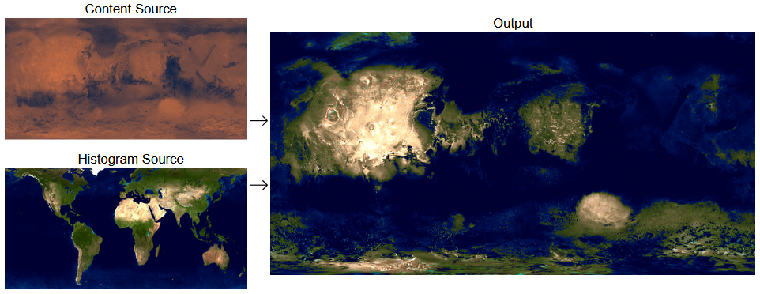

# Histogram Transfer

Given two images A and B, Histogram Transfer will create a new image with the content from image A and the histogram from image B.

You can try out the web demo [here](https://danielklisch.github.io/histogram_transfer/).

## Examples

Histogram Transfer can be used to change the look of textures while keeping the structure:

Histogram Transfer can also be used with more complicated images:

For the first examples textures from [shadertoy](https://www.shadertoy.com/view/tdSSzV) were used.
The images of [earth](https://visibleearth.nasa.gov/images/57730/the-blue-marble-land-surface-ocean-color-and-sea-ice) and [mars](https://astrogeology.usgs.gov/search/map/Mars/Viking/Color/Mars_Viking_ClrMosaic_global_925m) came from NASA.

## How It Works

The cumulative distribution function cdfA(x) of a random variable A gives the probability that A is smaller or equal to x.
Given a uniformly distributed random variable C between 0 and 1, the variable can be transformed to have the same distribution as A using the inverse cdf:

P(cdfA-1(C)=x) = P(A=x)

This means that the random variable A can be transformed to have a uniform distribution between 0 and 1 using its own cdf:

P(cdfA(A)=x) = P(cdfA(cdfA-1(C))=x) = P(C=x)

The color of a pixel can be viewed as a random variable.
In the case of a grayscale image the histogram is that variables probability density function.
The pobability density function is the derivative of the cumulative distribution function.
This means that transforming the random variable of pixel values will also transform the image histogram.

Using this knowledge, a random variable A can be transformed to have the distribution of another random variable B:

P(B=x) = P(cdfB-1(C)=x) = P(cdfB-1(cdfA(A))=x)

So to transform the histogram of A, the cdf of A, and the the inverse cdf of B is needed.
The inverse cdf can be built by listing all values and sorting the resulting list.

cdf-1(x) = valuessorted[x*nvalues]

This sorted list can also be used to build the cdf.
Since the pixels have values ranging from 0 to 255, the cdf can be represented by an array of 256 numbers.
The cdf is built by inverting the inverse cdf.
If a function g(x) is the inverse of f(x), the function as to be equal to x at the position f(x) for all x:

g(f(x)) = x

In the case of the inverse cdf with an index i

x = i/nvalues

so replacing f with the inverse cdf results in

cdf(cdf-1(i/nvalues)) = i/nvalues

and by the definition for cdf-1(x) this is equivalent to

cdf(valuessorted[i]) = i/nvalues

This relationship can be ensured for all inputs to cdf(x) by iterating over all values for i and assigning i/nvalues to the array representing the cdf at the position valuessorted[i].
In this way both cdfA and cdfB-1 can be found from the lists valuesA and valuesB.

This method can be used to transfer the histogram of a grayscale image.
In the case of a RGB image there are three random variables R, G, and B.
These variables are not independent, since the R value also correlates with the G and B value, and vice-versa.
The most extreme case is a grayscale image where R=G=B for all R, G, and B.
However, if you only consider the pixel where the other two channels have the same values, the above method can still be applied to the remaining channel.
This requires having 1 red channel cdf, 256 green channel cdfs (one for each red value), and 256*256 blue channel cdfs (one for each red/green combination).
First the transform is applied to the red channel.
Then the transform is applied to all pixels with R=i for i ranging from 0 to 255.
Lastly the transform is applied to all pixels with R=i and G=j for j ranging from 0 to 255.
This ensures that the correlation between the color channels is conserved.

The order in which the transform is applied can also be changed.
It is recommended to use the channel with the highest variance in values first.